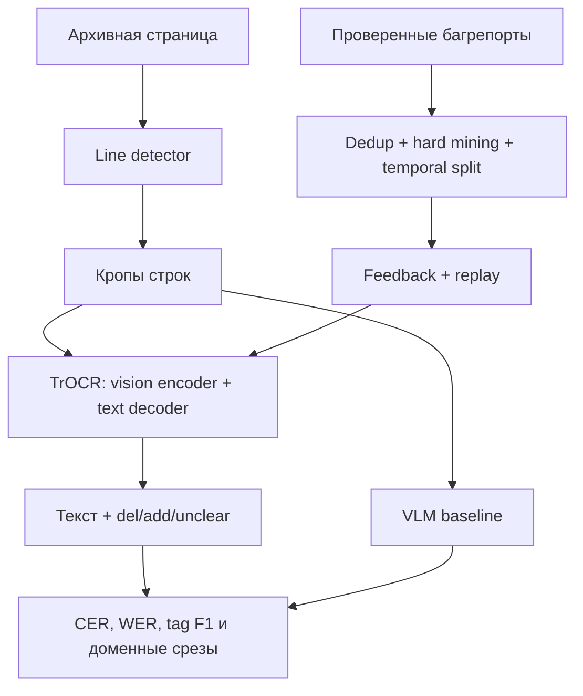

# Archive OCR Lab


Учебно-исследовательский проект по распознаванию архивных рукописей: transformer OCR,
редакторская разметка зачёркиваний и вставок, VLM-бейзлайн и continual fine-tuning на
проверенных пользовательских исправлениях.

Проект сделан как публичный аналог задач из описания подгруппы универсальных применений
CV Яндекса. Это **не внутренний стек Яндекса**: вакансия не раскрывает модели, библиотеки и
инфраструктуру команды. Здесь воспроизведены открытыми инструментами именно постановка
задачи и ключевые инженерные компромиссы.


*Синтетический smoke-пример: зачёркнутое слово сохраняется в `<del>`, вставка над строкой —
в `<add>`. Это иллюстрация контракта разметки, а не реальная рукопись.*

## Что здесь можно показать на интервью

- Полный путь `page image → line detection → transformer OCR → structured transcription`.
- Разметку «полёта мысли» через `<del>`, `<add>` и `<unclear>`, а не только плоский текст.
- Один и тот же held-out benchmark для компактного TrOCR и большой VLM.
- CER, WER, exact match и отдельный `tag_f1`, плюс срезы по языку, домену и деградации.
- PAGE XML импорт для реальных архивных коллекций и локальный синтетический датасет для
  smoke-теста без скачивания закрытых данных.
- Безопасное дообучение на багрепортах: дедупликация, document-level temporal split,
  hard-case ranking, replay старого домена и неизменяемый test set.
- LoRA для дешёвой адаптации декодера и ONNX/INT8-ветку как первый шаг к edge inference.
- FastAPI с line/page режимами и явным интерфейсом замены простого детектора на learned CV.

## Архитектура



Основное обучение идёт на кропах строк. Это осознанная декомпозиция: качество детекции
строк и качество HTR можно измерять отдельно. `ProjectionLineDetector` — объяснимый baseline
для почти горизонтального текста, а не заявка на универсальную layout-модель.

## Быстрый старт

Нужны Python 3.10+ и, для обучения модели, PyTorch. Команды ниже выполняются из корня
репозитория.

```bash
python -m venv .venv
source .venv/bin/activate              # Windows: .venv\Scripts\activate
python -m pip install -U pip
python -m pip install -e ".[dev]"

# 1. Сгенерировать строки с зачёркиваниями, вставками и архивными артефактами
archive-ocr make-demo-data --output data/demo --samples 120 --seed 42

# 2. Проверить файлы, XML-like разметку и отсутствие document leakage
archive-ocr validate-data data/demo/manifest.jsonl

# 3. Дообучить компактный transformer OCR
archive-ocr train configs/train_trocr.yaml

# 4. Посчитать held-out метрики и срезы
archive-ocr evaluate \
  outputs/trocr/best data/demo/manifest.jsonl outputs/eval --split test
```

Для CPU smoke-теста без установки ML-зависимостей достаточно Pillow, NumPy, PyYAML и
Pydantic:

```bash
PYTHONPATH=src python -m unittest discover -s tests -v
PYTHONPATH=src python -c \
  "from archive_ocr.synthetic import make_demo_dataset; print(make_demo_dataset('/tmp/ocr-demo', samples=18))"
```

### Почему дефолтный датасет синтетический

У архивов разные лицензии и правила распространения. Репозиторий не перетаскивает чужие
сканы и не притворяется, что синтетика измеряет production-качество. Она нужна для трёх
вещей: проверить весь pipeline, отладить формат редакторских операций и сделать минимальный
эксперимент воспроизводимым. Для содержательных результатов следует импортировать реальный
PAGE XML корпус и отдельно оформить его лицензию.

## Формат данных

Одна строка `manifest.jsonl` — один line crop:

```json
{
  "id": "tolstoy-page-001-line-07",
  "image": "images/tolstoy-page-001-line-07.png",
  "transcription": "Он <del>быстро</del> медленно вошёл.",
  "split": "train",
  "domain": "tolstoy_drafts",
  "language": "ru",
  "source": "pagexml",
  "document_id": "tolstoy-page-001",
  "writer_id": "author-01",
  "bbox": {"x0": 120, "y0": 418, "x1": 1730, "y1": 522},
  "degradation": ["faded_ink", "fold"]
}
```

Поддерживаются только ненестящиеся теги:

| Тег | Смысл | Что учит модель |
|---|---|---|
| `<del>…</del>` | видимое зачёркивание | прочитать удалённое, а не потерять его |
| `<add>…</add>` | вставка над/между строками | связать вставку с основной строкой |
| `<unclear>…</unclear>` | сомнительный фрагмент | не маскировать неопределённость |

В production-проекте словарь нужно согласовать с архивистами и преобразовывать в TEI/PAGE
XML. Маленький словарь здесь намеренный: он позволяет отдельно измерять качество структуры.

### Импорт PAGE XML

```bash
archive-ocr import-pagexml path/to/pagexml data/processed/bentham \
  --image-root path/to/page-images \
  --split train --domain bentham --language en
```

Конвертер читает `Page@imageFilename`, `TextLine/Coords` и `TextEquiv/Unicode`, сохраняет
кропы и bbox. Сплиты следует назначать **по документу или писцу**, а не случайно по строкам.
Иначе почерк и соседние строки одного листа попадут и в train, и в test.

## Основной OCR-эксперимент

`configs/train_trocr.yaml` использует `microsoft/trocr-small-handwritten`:

- изображение кодирует Vision Transformer;
- autoregressive decoder одновременно распознаёт символы и моделирует язык;
- шесть редакторских токенов добавляются в словарь;
- LoRA вставляется в attention декодера и перед финальным сохранением merge-ится;
- лучший checkpoint выбирается по validation CER;
- итоговый checkpoint загружается обычным `VisionEncoderDecoderModel.from_pretrained`.

Дефолтный checkpoint — удобный публичный baseline, **не полноценное решение для русского
архива**. Его pretraining не ориентирован на дореволюционную кириллицу, а byte-level словарь
для кириллицы менее эффективен. Содержательная следующая итерация: сравнить (1) multilingual
decoder, (2) новый кириллический tokenizer + продолженное pretraining, (3) VLM и (4)
distillation в компактную student-модель.

Если GPU не поддерживает FP16, код автоматически выключает его. Размер batch и число workers
нужно подбирать под конкретную машину.

## VLM-бейзлайн

Большая мультимодальная модель проверяется на **том же test split**, иначе сравнение нечестное:

```bash
python -m pip install -e ".[vlm]"
archive-ocr vlm-evaluate configs/vlm_qwen.yaml
```

По умолчанию используется Qwen2.5-VL-3B. Это не предложение поставить 3B-модель в мобильную
камеру. VLM здесь — дорогой upper baseline / teacher: проверить понимание сложной структуры,
получить псевдоразметку для последующей проверки и оценить потенциал distillation.

## Дообучение на пользовательских багрепортах

```bash
# Создать демонстрационные исправления
archive-ocr make-demo-feedback data/demo/manifest.jsonl data/feedback/raw.jsonl

# Отобрать hard cases, сделать temporal document split и добавить replay
archive-ocr build-feedback \
  data/demo/manifest.jsonl data/feedback/raw.jsonl data/feedback \
  --replay-ratio 0.35 --validation-ratio 0.10

# Дообучить с меньшим learning rate и замороженным encoder
archive-ocr train configs/train_feedback.yaml
```

`hardness_score` объединяет величину старой ошибки, низкую confidence, свежесть и число
повторных жалоб. Последнее временное окно целыми документами уходит в validation. В train
добавляется replay из исходного домена, а исходный test переносится без изменений.

Это baseline, а не законченная политика continual learning. В реальной системе ещё нужны:

- ручная модерация и provenance каждой правки;
- защита от poisoning и персональных данных;
- perceptual hash для почти одинаковых изображений;
- контроль распределения языков/доменов, а не один глобальный score;
- canary, regression suite и rollback перед выкладкой новой модели.

## Метрики

Главный `CER` считается по тексту без тегов, чтобы структурная ошибка не была дважды смешана
с символьной. Структура оценивается отдельно `tag_f1`.

```json
{
  "overall": {"samples": 18, "cer": 0.14, "wer": 0.31, "exact_match": 0.22, "tag_f1": 0.81},
  "by_language": {"ru": {"cer": 0.16}, "en": {"cer": 0.09}},
  "by_degradation": {"blur": {"cer": 0.21}, "faded_ink": {"cer": 0.18}}
}
```

Числа выше — только пример формата, не результат этого репозитория. Для интервью полезнее
обсудить не одну среднюю, а worst slices: архив, язык, писец, тип правки, качество скана.

## API и page mode

```bash
export ARCHIVE_OCR_CHECKPOINT=outputs/trocr/best
uvicorn archive_ocr.api:app --host 0.0.0.0 --port 8000

curl -F file=@data/demo/images/line-00000.png \
  "http://localhost:8000/v1/recognize?mode=line"
```

`mode=page` сначала запускает projection-profile detector, возвращает bbox строк и собирает
текст сверху вниз. На сложном рукописном layout его надо заменить сегментационной/детекторной
моделью; интерфейс `DetectedLine` уже отделяет эту замену от recognizer.

## ONNX и мобильное направление

```bash
python -m pip install -e ".[onnx]"
archive-ocr export-onnx outputs/trocr/best outputs/onnx --quantize

# Сравнивать latency только при одинаковых параметрах и на одном устройстве
archive-ocr benchmark outputs/trocr/best data/demo/images/line-00000.png \
  --warmup 5 --runs 30 --output outputs/benchmark.json
```

Ветка экспортирует vision encoder-decoder через Optimum и опционально делает dynamic INT8.
Это только начало mobile-track. Перед заявлением о готовности нужны проверки:

1. parity PyTorch/ONNX на golden set;
2. latency p50/p95, peak RAM, размер модели и энергопотребление **на целевых телефонах**;
3. CER regression после quantization;
4. distillation/pruning, если decoder generation остаётся узким местом;
5. отдельные профили для on-device и server fallback.

## Структура репозитория

```text
archive-ocr-lab/
├── configs/                 # воспроизводимые experiment configs
├── data/examples/           # примеры контрактов JSONL
├── docs/                    # архитектура, эксперименты и сценарий интервью
├── src/archive_ocr/
│   ├── augment.py           # архивные деградации
│   ├── data.py              # manifest + PyTorch dataset
│   ├── feedback.py          # hard mining, temporal split, replay
│   ├── layout.py            # explainable line detector baseline
│   ├── models.py            # TrOCR, special tokens, decoder LoRA
│   ├── pagexml.py           # PAGE XML converter
│   ├── synthetic.py         # offline synthetic HTR data
│   ├── train.py             # Seq2Seq training
│   ├── evaluate.py          # inference and sliced metrics
│   ├── vlm.py               # VLM experiment
│   ├── export_onnx.py       # edge export path
│   └── api.py               # FastAPI inference service
└── tests/                   # быстрые CPU unit/integration tests
```

## Что я бы делал дальше

1. Собрал legal-to-use русский historical HTR corpus с PAGE/TEI provenance.
2. Зафиксировал writer/document-disjoint test и challenge set: круговой текст, заломы,
   зачёркивания, поля, bleed-through, смешанные языки.
3. Сравнил TrOCR, multilingual decoder и VLM на одинаковых данных и compute budget.
4. Добавил learned text-line detector и end-to-end page metric.
5. Проверил data scaling law, затем сделал distillation VLM → compact OCR.
6. Провёл ONNX parity и device benchmark до выбора mobile architecture.

Более подробная защита решений — в `docs/ARCHITECTURE.md`, план экспериментов — в
`docs/EXPERIMENTS.md`, готовый 7-минутный рассказ — в `docs/INTERVIEW.md`.

## Contributing

Перед pull request запустите `make test` и не коммитьте внешние архивные изображения,
checkpoints или пользовательские багрепорты. Правила экспериментов и PR checklist описаны в
[`CONTRIBUTING.md`](CONTRIBUTING.md). Инструкция создания репозитория и первого push — в
[`docs/GITHUB_SETUP.md`](docs/GITHUB_SETUP.md).
